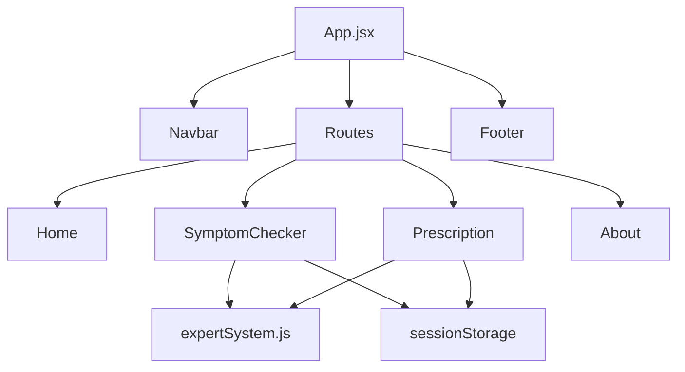
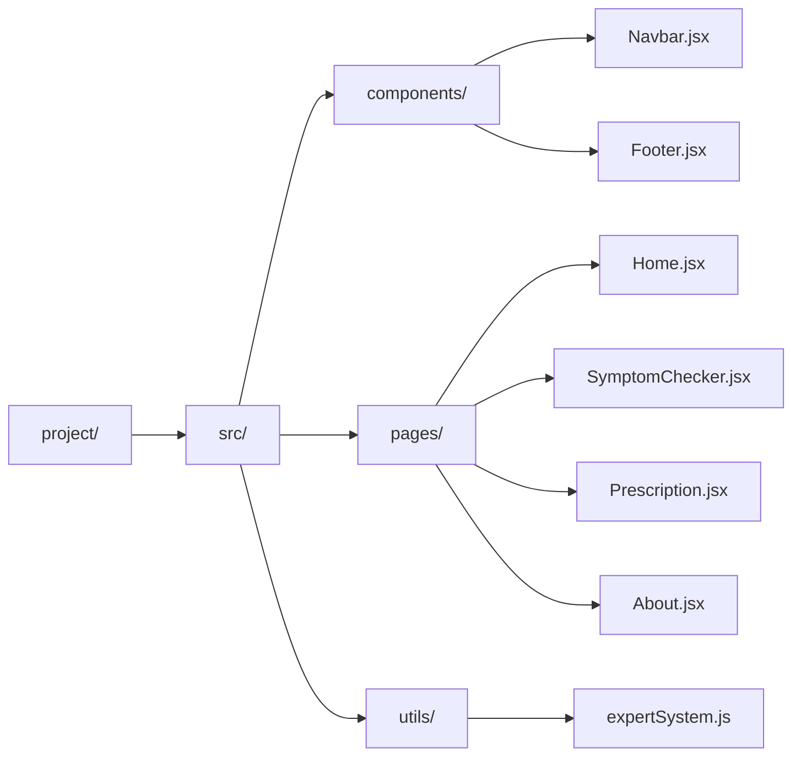
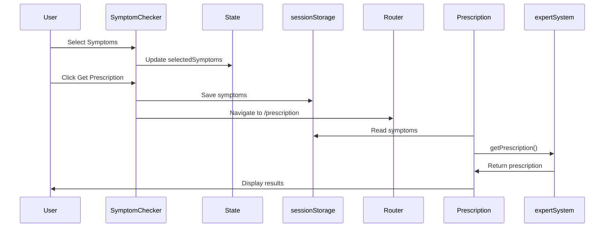

# Quick Reference: Structural Diagram Prompts for MedExpert

## 🎯 One-Line Prompts for AI Tools (ChatGPT, Claude, etc.)

### Component Structure Diagram
```
Create a React component hierarchy tree diagram for MedExpert showing App → Navbar/Footer → Routes → Pages (Home, SymptomChecker, Prescription, About) with their sub-components and data flow connections.
```

### File Structure Diagram
```
Create a file tree diagram showing the MedExpert project structure: src/ with components/, pages/, utils/ folders, and all JSX/CSS files organized hierarchically.
```

### Data Flow Diagram
```
Create a sequence diagram showing user interaction flow: User selects symptoms → SymptomChecker updates state → saves to sessionStorage → navigates to Prescription → reads from sessionStorage → calls expertSystem → displays prescription.
```

### System Architecture Diagram
```
Create a layered architecture diagram for MedExpert showing: Presentation Layer (React Components), Application Layer (Router/State), Business Logic Layer (Expert System), Data Layer (Knowledge Base/Session Storage), Infrastructure Layer (Vite).
```

### Component Interaction Diagram
```
Create a component interaction diagram showing how SymptomChecker component communicates with expertSystem utility, sessionStorage, and Prescription component through React Router navigation.
```

## 📊 Mermaid Code (Copy-Paste Ready)

### Component Structure


### File Structure


### Data Flow Sequence


## 🎨 For Visual Tools (Draw.io, Lucidchart, Figma)

### Component Hierarchy (Visual)
```
Create boxes for:
- App (root, large box)
  - Navbar (top bar)
  - Routes Container (middle section)
    - Home Page box
    - SymptomChecker Page box
    - Prescription Page box
    - About Page box
  - Footer (bottom bar)
- Expert System (side box, connected to SymptomChecker and Prescription)
- Session Storage (side box, connected to SymptomChecker and Prescription)

Use arrows to show:
- Parent-child relationships (downward)
- Data flow (horizontal)
- Navigation flow (curved)
```

### System Layers (Visual)
```
Create 5 horizontal layers (top to bottom):
1. Presentation Layer (blue) - React Components, Browser
2. Application Layer (green) - Router, State Management
3. Business Logic Layer (yellow) - Expert System
4. Data Layer (orange) - Knowledge Base, Session Storage
5. Infrastructure Layer (gray) - Vite, Build Tools

Show connections between layers with vertical arrows.
```

## 🔧 For Documentation Tools

### Markdown Structure
```markdown
# MedExpert Architecture

## Component Structure
- App (Root)
  - Navbar
  - Routes
    - Home
    - SymptomChecker
    - Prescription
    - About
  - Footer

## Data Flow
1. User Input → SymptomChecker
2. State Update → sessionStorage
3. Navigation → Prescription
4. Data Read → Expert System
5. Output → User Display
```

## 📝 For Presentations (PowerPoint/Keynote)

### Slide Structure
```
Slide 1: System Overview
- High-level architecture
- Main components

Slide 2: Component Hierarchy
- Tree structure
- Parent-child relationships

Slide 3: Data Flow
- User journey
- State management

Slide 4: Technology Stack
- React, Router, Vite
- Dependencies

Slide 5: Deployment
- Static hosting
- Build process
```

## 🚀 Quick Copy-Paste Prompts

### For ChatGPT/Claude:
```
Create a comprehensive structural diagram for MedExpert React application including:
1. Component hierarchy tree
2. File structure organization
3. Data flow between components
4. State management flow
5. Routing structure

Make it visual and easy to understand.
```

### For Draw.io:
```
Create a system architecture diagram with:
- Top layer: Browser/User Interface
- Second layer: React Components (App, Navbar, Footer, Pages)
- Third layer: Business Logic (Expert System)
- Bottom layer: Data Storage (Session Storage, Knowledge Base)

Show connections and data flow with arrows.
```

### For Mermaid Live Editor:
```
Copy any of the Mermaid code blocks above and paste into https://mermaid.live/
```

## 📋 Checklist for Complete Diagram Set

- [ ] Component Structure Diagram
- [ ] File Structure Tree
- [ ] Data Flow Sequence Diagram
- [ ] System Architecture Layers
- [ ] Component Interaction Diagram
- [ ] Deployment Architecture
- [ ] Use Case Diagram
- [ ] System Context Diagram

## 💡 Tips

1. **Start Simple**: Begin with component hierarchy, then add details
2. **Use Colors**: Different colors for different layers/components
3. **Add Labels**: Label all connections and data flows
4. **Keep Updated**: Update diagrams when code changes
5. **Multiple Views**: Create different diagrams for different audiences

---

**Full detailed prompts available in:** `SYSTEM_ARCHITECTURE_PROMPT.md`

