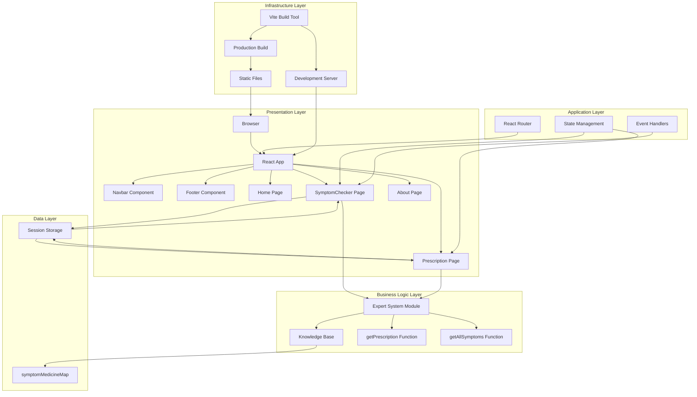

# System Architecture Prompt for MedExpert Project

Use this prompt with architecture diagram tools, AI assistants, or documentation tools to create comprehensive system architecture diagrams and documentation.

## Prompt for System Architecture Diagram

```
Create a comprehensive System Architecture Diagram for "MedExpert" - an Expert System for Medicine Prescription built with React.js. Include the following layers and components:

### Architecture Layers:

#### 1. Presentation Layer (Frontend)
- **Technology**: React.js 19.2.0 with Vite 7.2.4
- **Components**:
  - **App Component** (Root Container)
    - Manages routing and global state
    - Wraps all pages and shared components
  - **Navigation Components**
    - Navbar: Top navigation with active state management
    - Footer: Bottom navigation and information
  - **Page Components**:
    - Home Page: Landing page with features showcase
    - SymptomChecker Page: Interactive symptom selection interface
    - Prescription Page: Medicine prescription display and printing
    - About Page: Application information and disclaimers
  - **UI Features**:
    - Responsive design (mobile, tablet, desktop)
    - Modern CSS with gradients and animations
    - Client-side routing with React Router DOM 7.10.0

#### 2. Application Logic Layer (Business Logic)
- **Expert System Module** (`expertSystem.js`)
  - **Knowledge Base**: 
    - symptomMedicineMap: Object containing symptom-to-medicine mappings
    - 12+ predefined symptom types (Fever, Headache, Cough, Cold, Sore Throat, Nausea, Diarrhea, Stomach Pain, Muscle Pain, Insomnia, Allergy, Joint Pain, Dizziness)
    - Each symptom mapped to:
      - Array of recommended medicines
      - Medicine details (name, dosage, frequency, duration)
      - Severity level (mild, moderate, severe)
      - Symptom description
  - **Core Functions**:
    - `getPrescription(selectedSymptoms)`: Analyzes symptoms and generates prescription
    - `getAllSymptoms()`: Returns list of available symptoms
    - Symptom matching algorithm
    - Medicine deduplication logic
    - Multi-symptom combination handling

#### 3. State Management Layer
- **React Hooks**:
  - useState: Component-level state management
  - useEffect: Side effects and data fetching
  - useNavigate: Programmatic navigation
  - useLocation: Current route tracking
- **Session Storage**:
  - Temporary data persistence between pages
  - Stores selected symptoms
  - Used for prescription generation flow

#### 4. Routing Layer
- **React Router DOM**:
  - BrowserRouter: HTML5 history API routing
  - Routes: Route definitions
  - Route: Individual route components
  - Link: Navigation links
  - Navigation flow:
    - Home → SymptomChecker → Prescription
    - All pages accessible via Navbar/Footer

#### 5. Data Flow Architecture
```
User Input → SymptomChecker Component
    ↓
State Update (selectedSymptoms)
    ↓
Expert System Analysis (getPrescription)
    ↓
Knowledge Base Query (symptomMedicineMap)
    ↓
Prescription Generation
    ↓
Session Storage (temporary persistence)
    ↓
Prescription Component Display
    ↓
User Output (Prescription View)
```

#### 6. Build & Development Layer
- **Vite**: 
  - Fast development server
  - Hot Module Replacement (HMR)
  - Production build optimization
  - ES modules support
- **Development Tools**:
  - ESLint: Code quality and linting
  - React DevTools: Component debugging
  - Browser DevTools: Performance monitoring

#### 7. Deployment Architecture
- **Static Site Hosting**:
  - Build output: Static HTML, CSS, JS files
  - Can be deployed to:
    - Vercel
    - Netlify
    - GitHub Pages
    - AWS S3 + CloudFront
    - Any static hosting service
- **No Backend Required**:
  - Pure client-side application
  - No database needed
  - No API endpoints required
  - Knowledge base embedded in frontend code

### Technology Stack:
- **Frontend Framework**: React.js 19.2.0
- **Build Tool**: Vite 7.2.4
- **Routing**: React Router DOM 7.10.0
- **Styling**: CSS3 (Custom CSS, no framework)
- **Language**: JavaScript (ES6+)
- **Package Manager**: npm
- **Development Server**: Vite Dev Server
- **Browser APIs Used**: sessionStorage, window.print()

### Architectural Patterns:
1. **Component-Based Architecture**: Modular React components
2. **Single Page Application (SPA)**: Client-side routing
3. **Expert System Pattern**: Rule-based knowledge system
4. **Separation of Concerns**: 
   - Presentation (Components)
   - Business Logic (Expert System)
   - Data (Knowledge Base)
5. **Stateless Components**: Most components are functional
6. **Unidirectional Data Flow**: Props down, events up

### Data Structures:
- **Knowledge Base**: Nested object structure
  ```javascript
  {
    symptom: {
      medicines: [{name, dosage, frequency, duration}],
      severity: String,
      description: String
    }
  }
  ```
- **Prescription Data**: 
  ```javascript
  {
    prescriptions: [Medicine],
    symptomDetails: [SymptomDetail],
    totalSymptoms: Number
  }
  ```

### Security & Privacy:
- **Client-Side Only**: No data sent to servers
- **No User Data Collection**: No tracking or analytics
- **Session Storage**: Temporary, browser-specific
- **No Authentication**: Public access application
- **Disclaimer**: Medical advice warnings included

### Performance Characteristics:
- **Initial Load**: Fast (Vite optimization)
- **Bundle Size**: Small (no heavy dependencies)
- **Runtime**: Client-side only, no server latency
- **Caching**: Browser caching of static assets
- **Lazy Loading**: Potential for code splitting (future enhancement)

### Scalability Considerations:
- **Knowledge Base Expansion**: Easy to add new symptoms/medicines
- **Component Reusability**: Modular design allows easy extension
- **State Management**: Can upgrade to Redux/Context API if needed
- **Backend Integration**: Can add API layer for dynamic knowledge base
- **Database Integration**: Can migrate knowledge base to database

### Integration Points:
- **Current**: None (standalone application)
- **Potential Future**:
  - Medical API integration
  - Database for knowledge base
  - User authentication
  - Prescription history
  - Doctor consultation booking

### Error Handling:
- **Input Validation**: Symptom selection validation
- **Empty State Handling**: No symptoms selected warning
- **Navigation Guards**: Redirect if no data in sessionStorage
- **User Feedback**: Alert messages for errors

### Accessibility Features:
- **Semantic HTML**: Proper HTML structure
- **Responsive Design**: Mobile-first approach
- **Keyboard Navigation**: Standard browser navigation
- **Screen Reader Support**: Semantic elements
- **Color Contrast**: WCAG compliant colors

### Browser Compatibility:
- Modern browsers (Chrome, Firefox, Safari, Edge)
- ES6+ features required
- HTML5 APIs (sessionStorage)
- CSS3 features (gradients, flexbox, grid)
```

## Prompt for Layered Architecture Diagram

```
Create a Layered Architecture Diagram showing:

### Layer 1: User Interface Layer
- Browser (Chrome, Firefox, Safari, Edge)
- React Components (Pages, Navigation)
- CSS Styling
- User Interactions

### Layer 2: Application Layer
- React Router (Navigation Logic)
- Component State Management (useState, useEffect)
- Event Handlers
- Form Validation

### Layer 3: Business Logic Layer
- Expert System Module
- Symptom Analysis Logic
- Prescription Generation Algorithm
- Knowledge Base Query Engine

### Layer 4: Data Layer
- Knowledge Base (symptomMedicineMap)
- Session Storage (Browser API)
- In-Memory Data Structures

### Layer 5: Infrastructure Layer
- Vite Build System
- Development Server
- Production Build Process
- Static File Serving
```

## Prompt for Component Architecture Diagram

```
Create a Component Architecture Diagram showing:

### Root Level
- **App.jsx** (Root Component)
  - Wraps entire application
  - Manages routing
  - Provides layout structure

### Shared Components
- **Navbar.jsx**: Global navigation
- **Footer.jsx**: Global footer

### Page Components
- **Home.jsx**: Landing page
- **SymptomChecker.jsx**: Symptom selection interface
- **Prescription.jsx**: Prescription display
- **About.jsx**: Information page

### Utility Modules
- **expertSystem.js**: Business logic and knowledge base

### External Dependencies
- react-router-dom: Routing
- React: Core framework
- Browser APIs: sessionStorage, window.print()

### Data Flow
- Props: Parent to child
- State: Component internal
- Session Storage: Cross-component data
- Navigation: Programmatic routing
```

## Prompt for Data Flow Architecture

```
Create a Data Flow Diagram showing:

### Input Sources
1. User clicks symptom chips
2. User types in search box
3. User adds custom symptom
4. User clicks "Get Prescription"

### Processing Steps
1. SymptomChecker collects symptoms
2. State updates (selectedSymptoms array)
3. User triggers prescription request
4. getPrescription() function called
5. Expert system queries knowledge base
6. Symptom-to-medicine mapping
7. Medicine deduplication
8. Prescription object creation

### Storage Points
1. Component state (selectedSymptoms)
2. Session storage (temporary persistence)
3. In-memory knowledge base

### Output Destinations
1. Prescription page display
2. Print dialog
3. Browser console (if debugging)
```

## Prompt for Deployment Architecture

```
Create a Deployment Architecture Diagram showing:

### Development Environment
- Developer Machine
- Vite Dev Server (localhost:5173)
- Hot Module Replacement
- Source Code (src/)

### Build Process
- npm run build
- Vite bundler
- Code optimization
- Asset generation

### Production Artifacts
- dist/ folder
- Static HTML files
- Bundled JavaScript
- CSS files
- Assets

### Hosting Options
1. **Static Hosting**:
   - Vercel
   - Netlify
   - GitHub Pages
   - AWS S3 + CloudFront
   - Firebase Hosting

2. **CDN Distribution**:
   - Global content delivery
   - Edge caching
   - Fast load times

### User Access
- Browser requests
- HTTPS connection
- Static file serving
- No server-side processing
```

## Mermaid System Architecture Diagram Code



## Prompt for Microservices vs Monolithic Architecture

```
Describe the architecture of MedExpert:

### Current Architecture: Monolithic Frontend Application

**Characteristics:**
- Single codebase
- All functionality in one application
- Client-side only
- No service separation
- Self-contained expert system

**Advantages:**
- Simple deployment
- No network latency
- Easy to develop
- Fast performance
- Low infrastructure cost

**Disadvantages:**
- Knowledge base hardcoded
- Limited scalability
- No real-time updates
- No user persistence
- No multi-user features

### Potential Microservices Architecture (Future):

**Services:**
1. **Frontend Service**: React application
2. **Knowledge Base Service**: API for symptoms/medicines
3. **Prescription Service**: Prescription generation logic
4. **User Service**: Authentication and user data
5. **History Service**: Prescription history storage

**Communication:**
- REST APIs or GraphQL
- Service-to-service communication
- Database per service

**Benefits:**
- Scalable knowledge base
- Real-time updates
- User accounts
- Prescription history
- Multi-tenant support
```

## Instructions for Using These Prompts

1. **For Architecture Diagrams**:
   - Use with Draw.io, Lucidchart, or similar tools
   - Copy the relevant prompt section
   - Create diagrams based on the descriptions

2. **For AI Tools** (ChatGPT, Claude, etc.):
   - Copy the main system architecture prompt
   - Ask to generate a visual diagram
   - Request documentation based on the architecture

3. **For Documentation**:
   - Use these prompts to write architecture documentation
   - Include in project README or separate docs
   - Reference in project presentations

4. **For Mermaid**:
   - Use the Mermaid code directly
   - Paste in Markdown files
   - Render in GitHub, Notion, or Mermaid Live Editor

5. **For Presentations**:
   - Use these prompts to create architecture slides
   - Explain system design to stakeholders
   - Document technical decisions

## Key Architecture Highlights

- **Type**: Single Page Application (SPA)
- **Pattern**: Component-Based Architecture
- **Deployment**: Static Site (No Backend)
- **State Management**: React Hooks + Session Storage
- **Expert System**: Rule-Based Knowledge System
- **Scalability**: Easy to extend knowledge base
- **Performance**: Fast client-side processing
- **Security**: Client-side only, no data transmission

This architecture is designed for simplicity, performance, and ease of deployment while maintaining the ability to scale and extend in the future.


