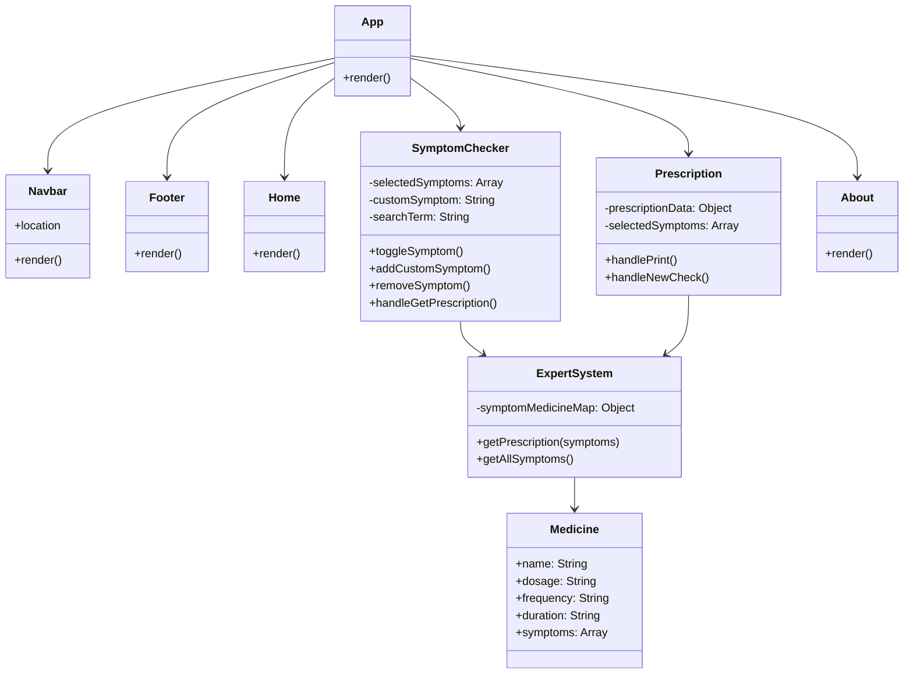

# UML Diagram Prompt for MedExpert Project

Use this prompt with UML diagram tools (PlantUML, Mermaid, Draw.io, Lucidchart, or AI diagram generators) to create comprehensive diagrams for the MedExpert project.

## Prompt for Class Diagram

```
Create a UML Class Diagram for a React.js Expert System application called "MedExpert" with the following structure:

### Main Application Component
- **App** (Component)
  - Properties: None
  - Methods: render()
  - Relationships: Uses Router, Contains Navbar, Footer, Routes

### Navigation Components
- **Navbar** (Component)
  - Properties: location (from useLocation hook)
  - Methods: render()
  - Relationships: Uses Link (from react-router-dom), Links to Home, SymptomChecker, Prescription, About

- **Footer** (Component)
  - Properties: None
  - Methods: render()
  - Relationships: Uses Link (from react-router-dom), Links to all pages

### Page Components
- **Home** (Component/Page)
  - Properties: None
  - Methods: render()
  - Relationships: Uses Link, Displays feature cards, hero section

- **SymptomChecker** (Component/Page)
  - Properties: 
    - selectedSymptoms: Array<String>
    - customSymptom: String
    - searchTerm: String
  - Methods: 
    - toggleSymptom(symptom)
    - addCustomSymptom()
    - removeSymptom(symptom)
    - handleGetPrescription()
  - Relationships: Uses getAllSymptoms(), getPrescription() from expertSystem, Navigates to Prescription page

- **Prescription** (Component/Page)
  - Properties:
    - prescriptionData: Object
    - selectedSymptoms: Array<String>
  - Methods:
    - handlePrint()
    - handleNewCheck()
  - Relationships: Uses getPrescription() from expertSystem, Reads from sessionStorage, Navigates to SymptomChecker

- **About** (Component/Page)
  - Properties: None
  - Methods: render()
  - Relationships: Displays information about the application

### Utility/Service Layer
- **expertSystem** (Utility Module)
  - Properties:
    - symptomMedicineMap: Object (Knowledge Base)
      - Key: symptom (String)
      - Value: Object containing:
        - medicines: Array<Medicine>
        - severity: String
        - description: String
  - Methods:
    - getPrescription(selectedSymptoms: Array<String>): Object
    - getAllSymptoms(): Array<String>

- **Medicine** (Data Structure)
  - Properties:
    - name: String
    - dosage: String
    - frequency: String
    - duration: String
    - symptoms: Array<String> (optional)

### External Dependencies
- **react-router-dom** (Library)
  - Classes: BrowserRouter, Routes, Route, Link, useNavigate, useLocation

- **React** (Library)
  - Hooks: useState, useEffect, useNavigate, useLocation

### Relationships Summary:
1. App contains Navbar, Footer, and Routes
2. Routes contain Home, SymptomChecker, Prescription, About
3. Navbar and Footer use Link components for navigation
4. SymptomChecker uses expertSystem.getAllSymptoms() and expertSystem.getPrescription()
5. Prescription uses expertSystem.getPrescription()
6. expertSystem contains symptomMedicineMap (Knowledge Base)
7. symptomMedicineMap contains Medicine objects
8. All components use React hooks (useState, useEffect, etc.)
9. SymptomChecker and Prescription use sessionStorage for data persistence
10. SymptomChecker navigates to Prescription after symptom selection
```

## Prompt for Component Diagram

```
Create a UML Component Diagram showing the architecture of MedExpert React application:

### Components:
1. **App Component** (Main Container)
   - Contains: Router, Navbar, Footer, Main Content Area

2. **Navigation Module**
   - Navbar Component
   - Footer Component

3. **Pages Module**
   - Home Page
   - SymptomChecker Page
   - Prescription Page
   - About Page

4. **Expert System Module** (Business Logic)
   - expertSystem.js (Knowledge Base & Logic)
   - symptomMedicineMap (Data Structure)
   - getPrescription() function
   - getAllSymptoms() function

5. **Routing Module**
   - React Router DOM
   - Route definitions
   - Navigation logic

6. **Storage Module**
   - sessionStorage (Browser API)
   - Used by: SymptomChecker, Prescription

### Dependencies:
- App → Navigation Module
- App → Pages Module
- App → Routing Module
- SymptomChecker → Expert System Module
- Prescription → Expert System Module
- SymptomChecker → Storage Module
- Prescription → Storage Module
- All Pages → Navigation Module (via App)
```

## Prompt for Sequence Diagram (User Flow)

```
Create a UML Sequence Diagram showing the user interaction flow:

### Actors:
- User
- Browser
- SymptomChecker Component
- Expert System Module
- Prescription Component
- sessionStorage

### Flow:
1. User opens application → Browser loads App component
2. User navigates to Symptom Checker → SymptomChecker component loads
3. SymptomChecker requests symptom list → Expert System returns getAllSymptoms()
4. User selects symptoms → SymptomChecker updates state
5. User adds custom symptom → SymptomChecker adds to selectedSymptoms
6. User clicks "Get Prescription" → SymptomChecker calls getPrescription()
7. Expert System analyzes symptoms → Returns prescription data
8. SymptomChecker stores data → sessionStorage.setItem('selectedSymptoms')
9. Browser navigates → Prescription component loads
10. Prescription reads data → sessionStorage.getItem('selectedSymptoms')
11. Prescription requests prescription → Expert System returns getPrescription()
12. Prescription displays results → User views prescription
13. User clicks "Print" → Browser print dialog opens
14. User clicks "New Check" → Prescription clears sessionStorage and navigates back
```

## Prompt for Use Case Diagram

```
Create a UML Use Case Diagram for MedExpert:

### Actor:
- User (Patient/Visitor)

### Use Cases:
1. **View Home Page**
   - Description: User can view the landing page with features and information

2. **Check Symptoms**
   - Description: User can select symptoms from a list or add custom symptoms
   - Includes: Search symptoms, Select multiple symptoms, Add custom symptom

3. **Get Prescription**
   - Description: User receives medication recommendations based on selected symptoms
   - Extends: Check Symptoms

4. **View Prescription Details**
   - Description: User can view detailed prescription with dosages and frequencies
   - Includes: View medicine information, View symptom details, Print prescription

5. **Navigate Between Pages**
   - Description: User can navigate using navbar or footer links
   - Includes: Navigate to Home, Navigate to Symptom Checker, Navigate to Prescription, Navigate to About

6. **Read About Information**
   - Description: User can read about the application and disclaimers

### Relationships:
- User → View Home Page
- User → Check Symptoms
- User → Get Prescription (extends Check Symptoms)
- User → View Prescription Details (extends Get Prescription)
- User → Navigate Between Pages
- User → Read About Information
```

## Prompt for Activity Diagram (Symptom Checking Process)

```
Create a UML Activity Diagram for the symptom checking and prescription generation process:

### Start: User opens Symptom Checker page

### Activities:
1. Load available symptoms from expert system
2. Display symptom list
3. User searches symptoms (optional)
4. User selects symptoms from list
5. User adds custom symptoms (optional)
6. System validates selected symptoms
7. User clicks "Get Prescription"
8. System checks if symptoms are selected
9. If no symptoms: Show error message
10. If symptoms exist: Call getPrescription() function
11. Expert system analyzes symptoms
12. Expert system matches symptoms to medicines
13. Expert system generates prescription data
14. Store symptoms in sessionStorage
15. Navigate to Prescription page
16. Load prescription data from sessionStorage
17. Display prescription with medicines
18. Display symptom details
19. User can print prescription
20. User can start new check

### Decision Points:
- Are symptoms selected? (Yes/No)
- Does user want to add more symptoms? (Yes/No)
- Does user want to print? (Yes/No)
- Does user want new check? (Yes/No)

### End: User views prescription or starts new check
```

## Prompt for State Diagram (Component States)

```
Create a UML State Diagram showing state transitions for SymptomChecker component:

### States:
- **Initial**: Component mounted, no symptoms selected
- **Searching**: User typing in search box
- **Symptoms Selected**: One or more symptoms selected
- **Custom Input**: User entering custom symptom
- **Loading**: Processing prescription request
- **Ready to Submit**: Symptoms selected, ready to get prescription
- **Error**: No symptoms selected when trying to submit

### Transitions:
- Initial → Searching (user types in search)
- Searching → Initial (search cleared)
- Initial → Symptoms Selected (user selects symptom)
- Symptoms Selected → Symptoms Selected (user selects more symptoms)
- Symptoms Selected → Initial (user removes all symptoms)
- Initial → Custom Input (user clicks custom input)
- Custom Input → Symptoms Selected (user adds custom symptom)
- Symptoms Selected → Ready to Submit (symptoms available)
- Ready to Submit → Loading (user clicks "Get Prescription")
- Loading → Initial (navigation to Prescription page)
- Ready to Submit → Error (user clicks without symptoms - should not happen)
```

## Mermaid Diagram Code (Ready to Use)

You can also use this Mermaid code directly in Markdown files or Mermaid-compatible tools:



## Instructions for Using These Prompts

1. **For PlantUML**: Copy the class diagram prompt and convert to PlantUML syntax
2. **For Mermaid**: Use the Mermaid code provided above
3. **For Draw.io/Lucidchart**: Use the component or class diagram prompts
4. **For AI Tools** (ChatGPT, Claude, etc.): Copy any of the prompts and ask to generate the diagram
5. **For Documentation**: Include these diagrams in your project documentation

These prompts provide comprehensive coverage of the MedExpert application architecture, data flow, and user interactions.


